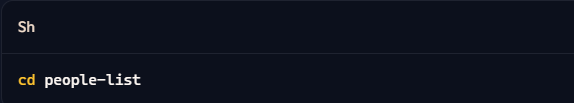

# People List

## Overview

The People List project is a web application designed to manage and display a list of people. It allows users to add, remove, and search for people in the list. The application fetches initial data from an external API and provides a user-friendly interface for managing the list.

## Features

- **Fetch Initial Data**: Retrieves a list of people from an external API.
- **Add New Person**: Allows users to add new people to the list with details such as name, phone, email, city, and zipcode.
- **Remove Person**: Users can remove people from the list.
- **Search Functionality**: Provides a search bar to filter the list by name.
- **Sort List**: Allows sorting the list by name in ascending or descending order.
- **Responsive Design**: Ensures the application is usable on various screen sizes.

## Technologies Used

- **HTML**: Structure of the web application.
- **CSS**: Styling for the application, including responsive design.
- **JavaScript**: Functionality for fetching data, managing the list, and handling user interactions.
- **Fetch API**: Used to retrieve initial data from an external source.

## Getting Started

To get started with the People List project, follow these steps:

1. **Clone the Repository**:

   ```sh
   git clone https://github.com/yourusername/people-list.git

   ```

2. **Navigate to the Project Directory**:
   

3. **Open the Project in Your Preferred Code Editor**

4. **Open index.html in Your Browser to view the application**
